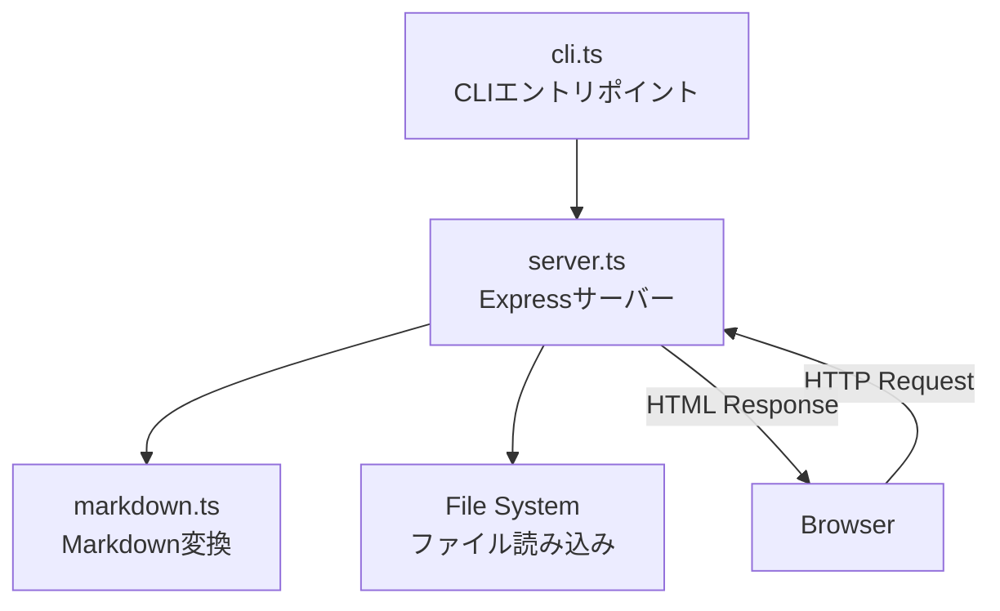
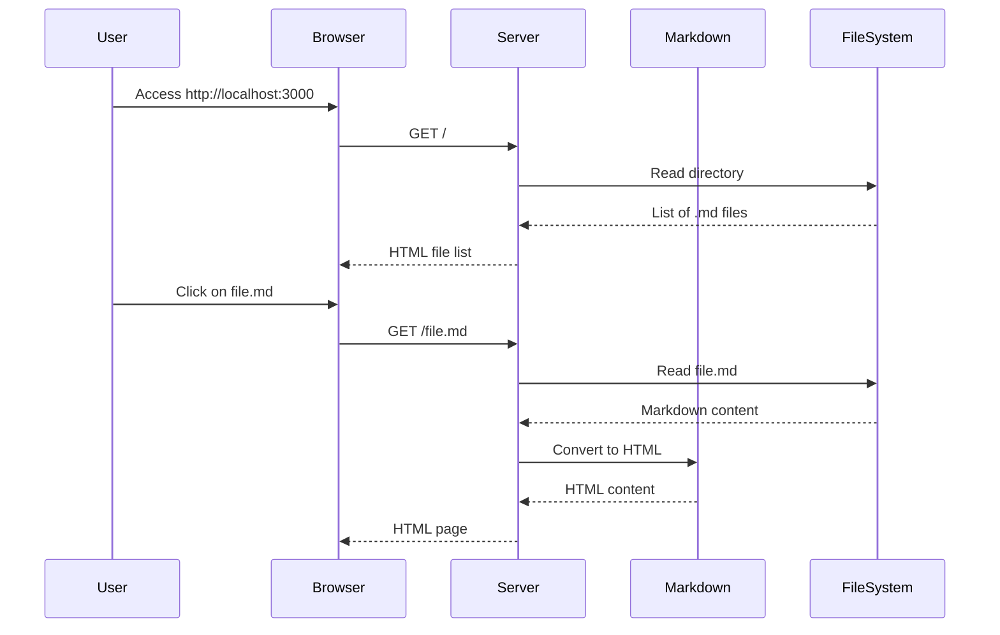

# Design: 001-minimal-server

## Architecture Overview



## Component Design

### 1. CLI Component (`src/cli.ts`)

**責務**: コマンドライン引数の解析とサーバーの起動

```typescript
// インターフェース
interface CLIOptions {
  port: number;
}

// 使用ライブラリ: commander
```

**処理フロー**:
1. コマンドライン引数をパース
2. オプションを抽出（port）
3. サーバーを起動

### 2. Server Component (`src/server.ts`)

**責務**: HTTPリクエストの処理とレスポンスの生成

```typescript
// エクスポート関数
function createServer(options: ServerOptions): Express;
function startServer(app: Express, port: number): Promise<void>;

interface ServerOptions {
  publicDir: string;  // 公開ディレクトリ（デフォルト: process.cwd()）
}
```

**エンドポイント**:

| Method | Path | Description |
|--------|------|-------------|
| GET | `/` | Markdownファイル一覧をHTML形式で返す |
| GET | `/:filename.md` | 指定されたMarkdownファイルをHTMLに変換して返す |

### 3. Markdown Component (`src/markdown.ts`)

**責務**: MarkdownテキストをHTMLに変換

```typescript
// エクスポート関数
function convertMarkdownToHtml(markdown: string): string;
function wrapWithHtmlTemplate(content: string, title: string): string;
```

## Data Flow



## Domain Models

### FileInfo

```typescript
interface FileInfo {
  name: string;      // ファイル名（例: "README.md"）
  path: string;      // URLパス（例: "/README.md"）
}
```

### HTMLTemplate

シンプルなHTMLテンプレートを使用:

```html
<!DOCTYPE html>
<html lang="ja">
<head>
  <meta charset="UTF-8">
  <meta name="viewport" content="width=device-width, initial-scale=1.0">
  <title>{title}</title>
  <style>
    /* 基本的なスタイル */
  </style>
</head>
<body>
  {content}
</body>
</html>
```

## Error Handling

| Error Case | HTTP Status | Response |
|------------|-------------|----------|
| ファイルが見つからない | 404 | "File not found" |
| ファイル読み込みエラー | 500 | "Internal server error" |
