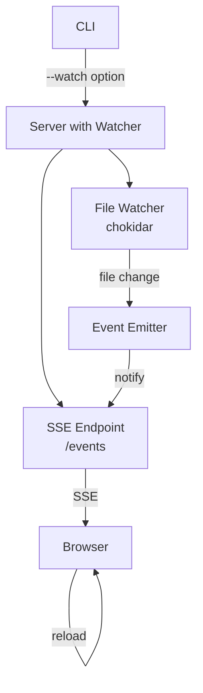
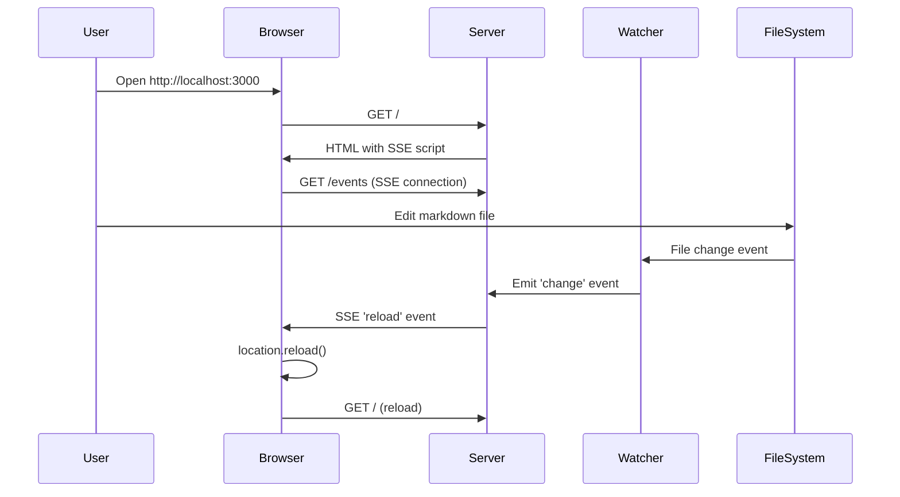

# Design: --watch Option

## Architecture Overview

`--watch` オプションは、ファイル監視と自動リロード機能を提供します。以下の3つの主要コンポーネントで構成されます：

1. **File Watcher**: chokidar を使用して Markdown ファイルの変更を監視
2. **SSE Endpoint**: Server-Sent Events を使用してブラウザに変更を通知
3. **Client Script**: ブラウザ側で SSE を受信し、ページをリロード



## Component Design

### 1. CLI (cli.ts)

`--watch` オプションを追加し、サーバーに `watch` フラグを渡します。

```typescript
program
  .option('-w, --watch', 'watch for file changes and auto-reload')
  .action(async (options) => {
    const watch = options.watch ?? false;
    const app = createServer({ publicDir, watch });
    // ...
  });
```

### 2. File Watcher (watcher.ts - 新規作成)

chokidar を使用してファイル変更を監視し、EventEmitter で変更を通知します。

```typescript
import chokidar from 'chokidar';
import { EventEmitter } from 'events';

export interface FileWatcher extends EventEmitter {
  close(): Promise<void>;
}

export function createWatcher(dir: string): FileWatcher;
```

### 3. Server Extensions (server.ts)

#### 3.1 ServerOptions の拡張

```typescript
export interface ServerOptions {
  publicDir: string;
  watch?: boolean;
}
```

#### 3.2 SSE Endpoint の追加

`/events` エンドポイントを追加し、クライアントとの接続を維持します。

```typescript
app.get('/events', (req, res) => {
  res.setHeader('Content-Type', 'text/event-stream');
  res.setHeader('Cache-Control', 'no-cache');
  res.setHeader('Connection', 'keep-alive');
  // ファイル変更時に 'reload' イベントを送信
});
```

#### 3.3 Client Script の注入

`--watch` モードの場合、HTML レスポンスに自動リロードスクリプトを注入します。

```javascript
const eventSource = new EventSource('/events');
eventSource.addEventListener('reload', () => {
  location.reload();
});
```

## Data Flow



## Domain Models

### FileChangeEvent

```typescript
interface FileChangeEvent {
  type: 'add' | 'change' | 'unlink';
  path: string;
  timestamp: number;
}
```

### SSEClient

```typescript
interface SSEClient {
  id: string;
  response: express.Response;
  connectedAt: Date;
}
```

## File Structure

```
src/
├── cli.ts          # CLI entry point (modified)
├── server.ts       # Express server (modified)
├── markdown.ts     # Markdown conversion (no change)
├── watcher.ts      # File watcher (new)
└── reload-script.ts # Client-side reload script (new)
```

## Error Handling

1. **Watcher initialization failure**: ログにエラーを出力し、watch モードを無効化してサーバーを継続
2. **SSE connection lost**: クライアント側で自動再接続（EventSource のデフォルト動作）
3. **File read error**: 個別のエラーとして処理し、他のファイル監視には影響を与えない

## Security Considerations

1. SSE エンドポイントは localhost からの接続のみを想定
2. ファイル監視は指定されたディレクトリ内のみに制限
3. クライアントスクリプトは外部リソースを読み込まない
