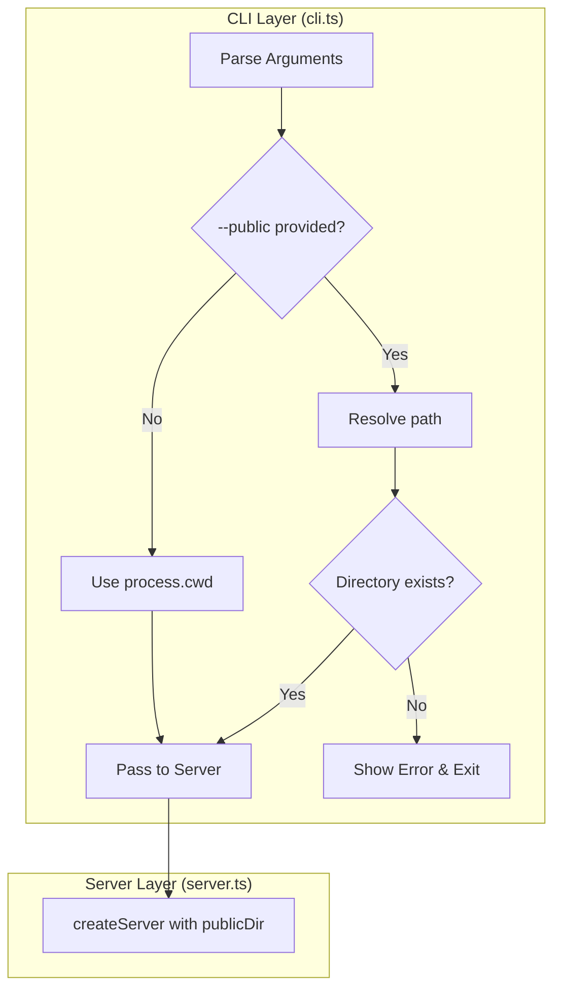
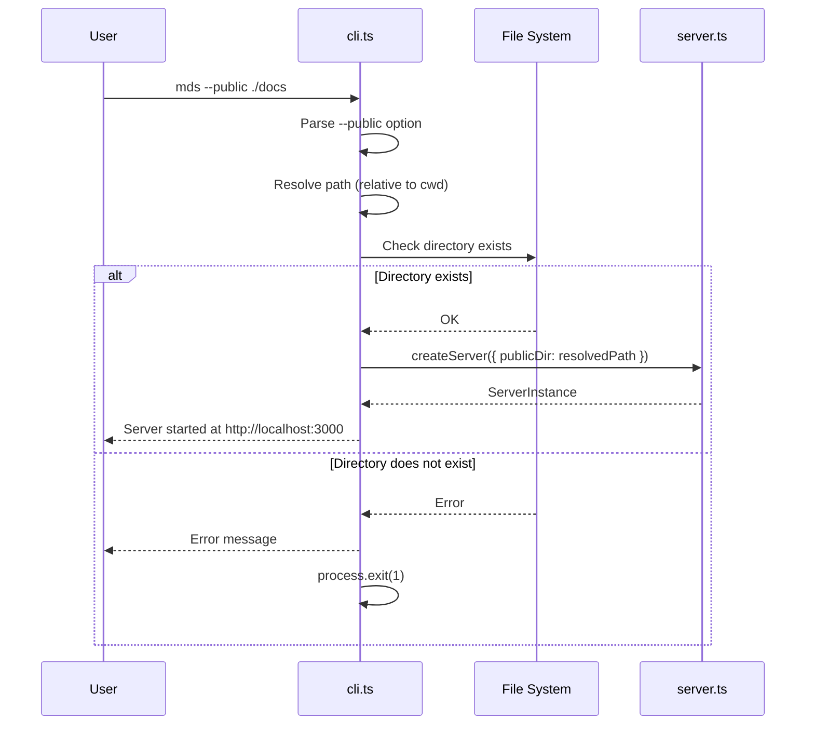

# Design: --public Option

## Architecture Overview

The `--public` option implementation involves minimal changes to the existing architecture. The change is primarily in the CLI layer, with the server core remaining unchanged since it already accepts `publicDir` as a configuration option.



## Component Design

### Modified Components

#### 1. CLI Module (`src/cli.ts`)

**Current State:**
- Accepts `--port` and `--watch` options
- Hardcodes `publicDir` as `process.cwd()`

**Changes Required:**
- Add `--public` / `-P` option using commander
- Resolve the provided path (handle relative/absolute)
- Validate directory existence
- Pass resolved path to `createServer()`

**Interface Changes:**
```typescript
// New option added to program
program
  .option('-P, --public <path>', 'directory to serve markdown files from', process.cwd())
```

### Unchanged Components

The following components require no changes:
- `server.ts` - Already accepts `publicDir` in `ServerOptions`
- `markdown.ts` - No path handling
- `watcher.ts` - Receives path from server configuration
- `reload-script.ts` - No path handling

## Data Flow



## Domain Models

No new domain models are required. The existing `ServerOptions` interface already supports the `publicDir` configuration:

```typescript
// Existing interface in server.ts (no changes needed)
export interface ServerOptions {
  publicDir: string;
  watch?: boolean;
}
```

## Error Handling

### Invalid Directory Path

When the specified directory does not exist or is not accessible:

1. Display a user-friendly error message to stderr
2. Exit with code 1

**Error Message Format:**
```
Error: Directory '<path>' does not exist or is not accessible.
```

## Implementation Notes

1. **Path Resolution**: Use `path.resolve()` to handle both relative and absolute paths consistently.

2. **Directory Validation**: Use `fs.existsSync()` and `fs.statSync()` to verify:
   - The path exists
   - The path is a directory (not a file)

3. **Commander Default**: Set `process.cwd()` as the default value so existing behavior is preserved.

4. **Short Option**: Use `-P` (uppercase) to avoid conflict with potential future options like `-p` for port (though `-p` is already used for port).
