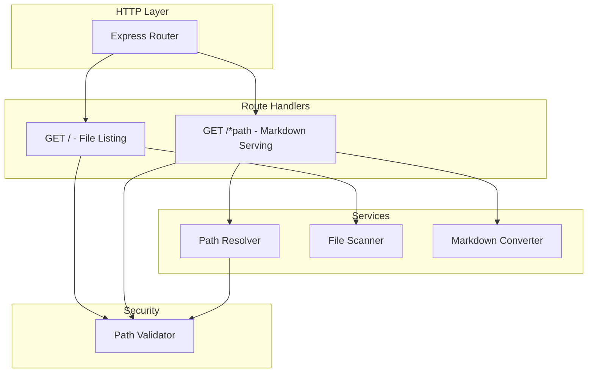
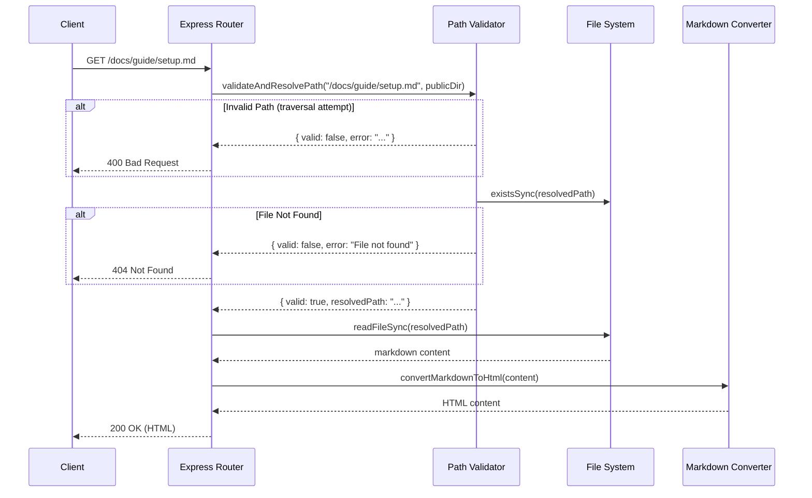
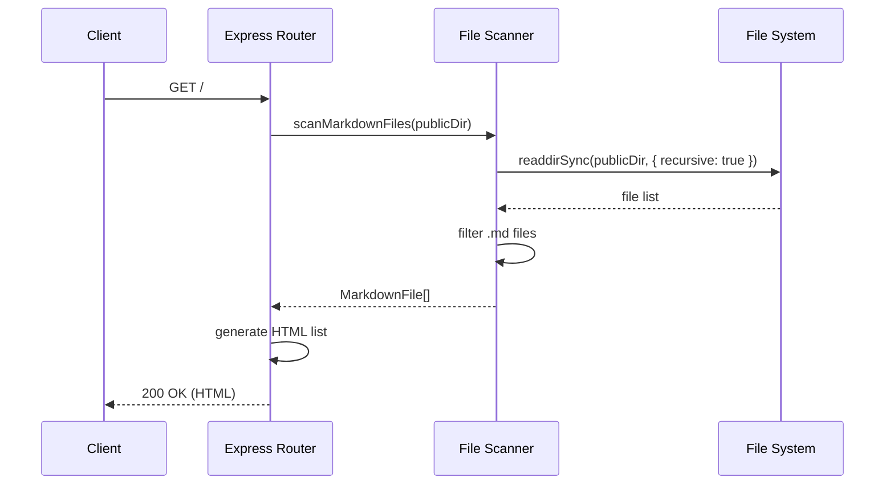

# Design: Subdirectory Markdown Serving

## Architecture Overview

サブディレクトリ対応のために、以下のコンポーネントを変更・追加します。



## Component Design

### 1. Route Handler Changes (`src/server.ts`)

#### 変更前
```typescript
app.get('/:filename.md', (req, res) => { ... });
```

#### 変更後
```typescript
app.get('/*.md', (req, res) => { ... });
// または
app.get(/^\/(.+\.md)$/, (req, res) => { ... });
```

Expressのワイルドカードルートを使用して、任意の深さのパスをマッチさせます。

### 2. Path Validator (`src/path-validator.ts`) - 新規

パストラバーサル攻撃を防ぐためのバリデーション機能を追加します。

```typescript
interface PathValidationResult {
  valid: boolean;
  resolvedPath?: string;
  error?: string;
}

function validateAndResolvePath(
  requestPath: string,
  publicDir: string
): PathValidationResult;
```

**バリデーションロジック:**
1. パスを正規化（`path.normalize()`）
2. `..` セグメントが含まれていないか確認
3. 解決後のパスが `publicDir` 内に収まっているか確認
4. ファイルが存在し、`.md` 拡張子であることを確認

### 3. File Scanner (`src/file-scanner.ts`) - 新規

再帰的にMarkdownファイルを探索する機能を追加します。

```typescript
interface MarkdownFile {
  relativePath: string;  // "subdir/file.md"
  absolutePath: string;  // "/public/subdir/file.md"
}

function scanMarkdownFiles(publicDir: string): MarkdownFile[];
```

**実装方針:**
- `fs.readdirSync()` と `recursive: true` オプションを使用（Node.js 18.17+）
- または再帰的なディレクトリ走査を実装

### 4. Watcher Changes (`src/watcher.ts`)

現在の実装を確認し、サブディレクトリの監視が有効になっているか確認します。
`chokidar` の `recursive` オプションが有効であれば変更不要の可能性があります。

## Data Flow

### Markdown File Request Flow



### File Listing Flow



## Domain Models

### MarkdownFile

```typescript
interface MarkdownFile {
  /** 相対パス（URL用）: "docs/guide/setup.md" */
  relativePath: string;

  /** 絶対パス（ファイル読み込み用）: "/path/to/public/docs/guide/setup.md" */
  absolutePath: string;

  /** ファイル名: "setup.md" */
  filename: string;

  /** ディレクトリパス: "docs/guide" */
  directory: string;
}
```

### PathValidationResult

```typescript
interface PathValidationResult {
  /** バリデーション結果 */
  valid: boolean;

  /** 正規化・解決後の絶対パス */
  resolvedPath?: string;

  /** エラーメッセージ */
  error?: string;
}
```

## Security Considerations

### パストラバーサル攻撃対策

以下のパターンをブロックします：

| 攻撃パターン | 例 | 対策 |
|-------------|-----|------|
| 相対パス上昇 | `/../etc/passwd` | `..` セグメントを禁止 |
| URLエンコード | `/%2e%2e/etc/passwd` | デコード後にチェック |
| Null byte injection | `/file.md%00.jpg` | 正規化後のパスをチェック |

**実装方針:**
1. `decodeURIComponent()` でURLデコード
2. `path.normalize()` でパスを正規化
3. `path.resolve()` で絶対パスに変換
4. 結果のパスが `publicDir` で始まることを確認

```typescript
function isPathSafe(requestPath: string, publicDir: string): boolean {
  const normalizedPublicDir = path.resolve(publicDir);
  const resolvedPath = path.resolve(publicDir, requestPath);
  return resolvedPath.startsWith(normalizedPublicDir + path.sep);
}
```

## File Structure Changes

```
src/
├── server.ts          # 変更: ルーティングロジック
├── path-validator.ts  # 新規: パスバリデーション
├── file-scanner.ts    # 新規: 再帰的ファイル探索
├── markdown.ts        # 変更なし
├── public-dir.ts      # 変更なし
├── watcher.ts         # 確認（変更不要の可能性）
└── cli.ts             # 変更なし

tests/
├── server.test.ts        # 変更: サブディレクトリテスト追加
├── path-validator.test.ts # 新規
├── file-scanner.test.ts   # 新規
└── ...
```
