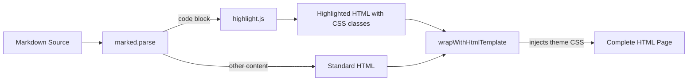
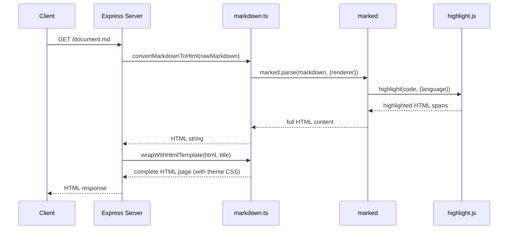

# Issue #6: Syntax Highlighting — Design

## Architecture Overview

Syntax highlighting will be implemented **server-side** by integrating [highlight.js](https://highlightjs.org/) with the existing `marked` markdown parser. When `marked` encounters a fenced code block, it will delegate to highlight.js for tokenizing and colorizing the code. The resulting HTML (with `` elements and CSS classes) is then included in the rendered page. The highlight.js theme CSS is embedded inline in the HTML template.

## Component Design

### Modified Components

#### `src/markdown.ts`

- **`convertMarkdownToHtml`**: Configure `marked` with a custom renderer that uses highlight.js for code blocks.
  - When a language is specified: use `hljs.highlight(code, { language })` with auto-fallback.
  - When no language is specified: use `hljs.highlightAuto(code)` for best-effort detection.
  - If the language is unknown or highlighting fails: fall back to plain text (escape HTML, no highlighting).
- **`wrapWithHtmlTemplate`**: Add highlight.js theme CSS (GitHub-style theme) inline in the `<style>` block.

### No New Components

The change is contained entirely within the existing `markdown.ts` module. No new files, routes, or modules are needed.

## Data Flow

## Domain Models

No new domain models are introduced. The change only affects the rendering pipeline.

### Dependencies

| Package | Purpose |
|---------|---------|
| `highlight.js` | Server-side syntax highlighting engine |

highlight.js is chosen because:
1. It integrates cleanly with `marked` via the custom renderer API.
2. It supports 190+ languages out of the box.
3. It includes many built-in themes.
4. It works both server-side and client-side (we use server-side).
5. It is the most widely adopted highlighting library in the JavaScript ecosystem.

### Theme Selection

The **GitHub** theme will be used as it provides a clean, familiar look that harmonizes with the existing light background and color palette of the application.
