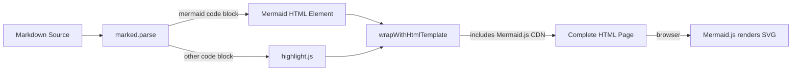
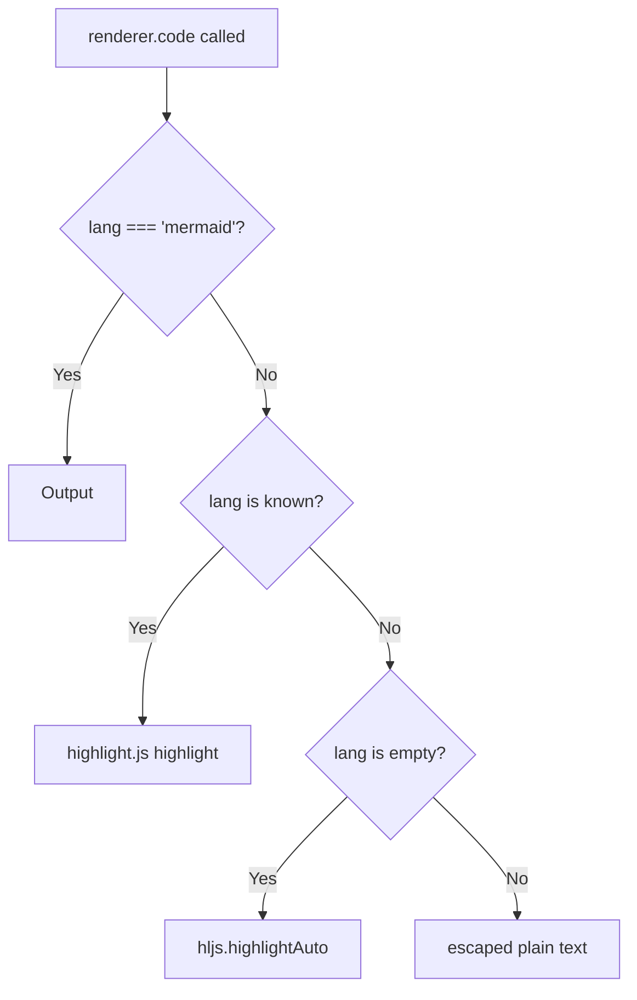
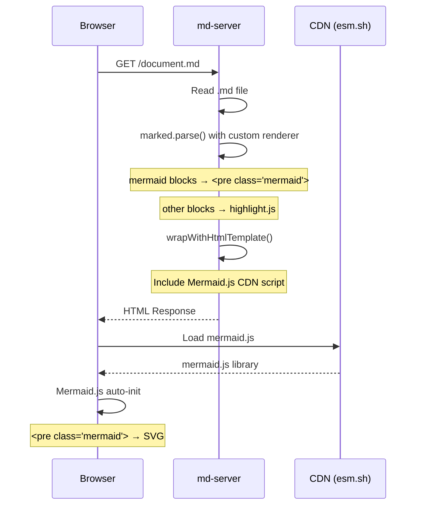

# 008: Mermaid Diagram Rendering - Design

## Architecture Overview

Mermaidダイアグラムのレンダリングはクライアントサイドで行う。サーバー側ではMermaidコードブロックを特別なHTML要素として出力し、ブラウザ上でMermaid.jsライブラリがそれをSVGに変換する。



## Component Design

### markdown.ts の変更

#### カスタムレンダラーの拡張

既存の `renderer.code` 関数に、`lang === 'mermaid'` の場合の分岐を追加する。



Mermaidコードブロックの場合、以下のHTML要素を出力する:

```html
<pre class="mermaid">{mermaid code}</pre>
```

Mermaid.jsは `class="mermaid"` を持つ `<pre>` 要素を自動的に検出し、SVGに変換する。

#### HTMLテンプレートの拡張

`wrapWithHtmlTemplate` 関数に以下を追加する:

1. Mermaid.js CDNスクリプトの読み込み（`<script>` タグ）
2. Mermaidの初期化は不要（Mermaid.js v10+はauto-initをサポート）

## Data Flow



## Domain Models

変更対象は `markdown.ts` の2つの関数のみ:

| 関数 | 変更内容 |
|------|----------|
| `renderer.code` | `lang === 'mermaid'` の場合に `<pre class="mermaid">` を出力する分岐を追加 |
| `wrapWithHtmlTemplate` | Mermaid.js CDNスクリプトを `<body>` の末尾に追加 |
