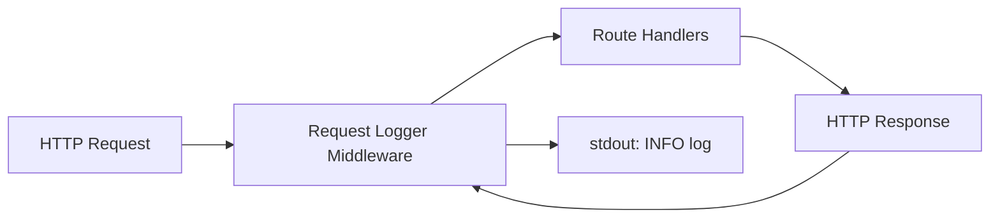
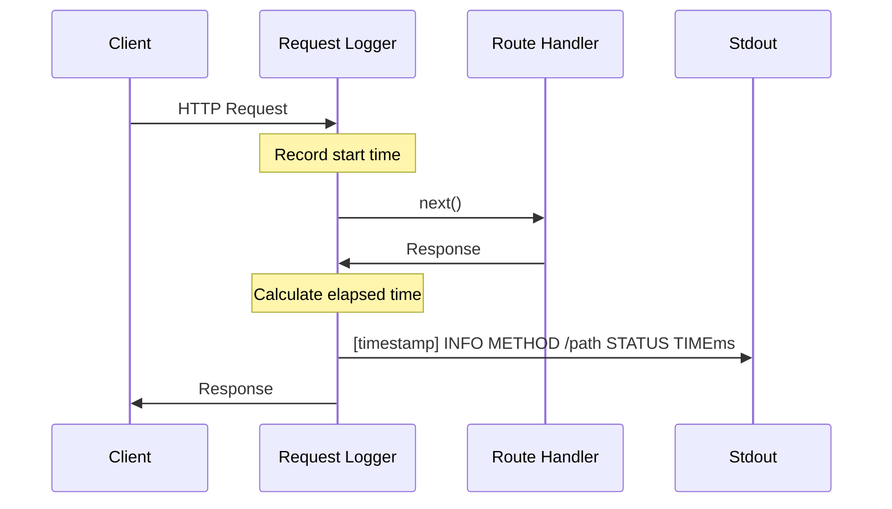

# Issue #10: Request Logging - Design

## Architecture Overview

Expressのミドルウェアとしてリクエストロガーを実装し、`createServer` 内で最初のミドルウェアとして登録する。

## Component Design

### `src/logger.ts`

リクエストログを出力するExpressミドルウェアを提供するモジュール。

#### `requestLogger(): RequestHandler`

Expressミドルウェアを返すファクトリ関数。

- リクエスト受信時に開始時刻を記録する
- レスポンス完了時(`res.on('finish')`)にログを出力する
- ログフォーマット: `[ISO8601] INFO METHOD /path STATUS TIMEms`
- 例: `[2024-01-15T10:30:00.000Z] INFO GET / 200 5ms`

### `src/server.ts` の変更

- `requestLogger` をインポートし、ルートハンドラより前にミドルウェアとして登録する

## Data Flow

## Domain Models

ログミドルウェアは特別なドメインモデルを持たない。Expressの `Request` と `Response` オブジェクトを利用する。
