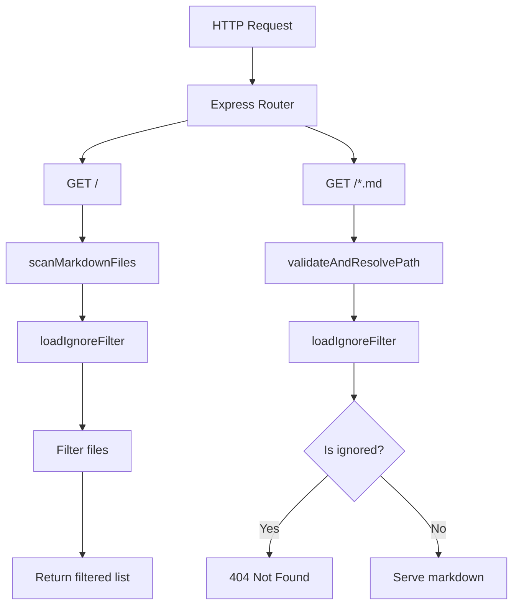
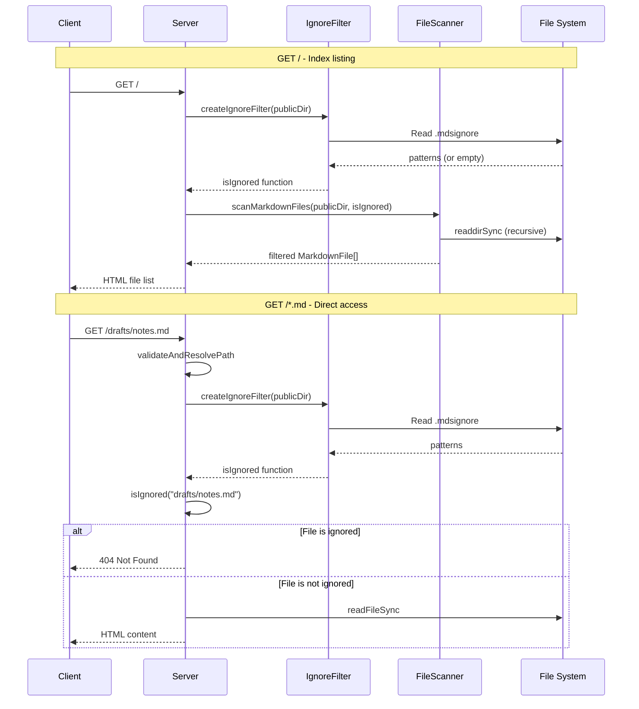

# Design: .gitignore-style File Exclusion (#12)

## Architecture Overview

A new `ignore-filter` module is introduced to handle loading and applying `.mdsignore` patterns. This module integrates into the existing file-scanning and request-handling pipelines.



## Component Design

### New Module: `src/ignore-filter.ts`

This module provides two main functions:

#### `loadIgnorePatterns(publicDir: string): string[]`

- Reads the `.mdsignore` file from the root of `publicDir`.
- Returns an array of pattern strings.
- Returns an empty array if the file does not exist or cannot be read.

#### `createIgnoreFilter(publicDir: string): (relativePath: string) => boolean`

- Loads patterns using `loadIgnorePatterns`.
- Uses the `ignore` npm package to compile patterns into a filter.
- Returns a function `isIgnored(relativePath: string) => boolean`.
- If no patterns exist, returns a function that always returns `false`.

### Modified Module: `src/file-scanner.ts`

- `scanMarkdownFiles` receives an optional ignore filter function parameter.
- When provided, files matching the filter are excluded from the result.

### Modified Module: `src/server.ts`

- On `GET /`: Creates ignore filter and passes it to `scanMarkdownFiles`.
- On `GET /*.md`: After path validation succeeds, checks if the file is ignored. If ignored, returns 404.

## Data Flow



## Domain Models

### Ignore Filter

```mermaid
classDiagram
    class IgnoreFilter {
        +loadIgnorePatterns(publicDir: string): string[]
        +createIgnoreFilter(publicDir: string): IsIgnoredFn
    }

    class IsIgnoredFn {
        <<type alias>>
        (relativePath: string) => boolean
    }

    class FileScanner {
        +scanMarkdownFiles(publicDir: string, isIgnored?: IsIgnoredFn): MarkdownFile[]
    }

    IgnoreFilter --> IsIgnoredFn : creates
    FileScanner --> IsIgnoredFn : uses
```

## Dependencies

### New npm dependency: `ignore`

- **Package**: [`ignore`](https://www.npmjs.com/package/ignore)
- **Purpose**: Provides `.gitignore`-compatible pattern matching.
- **Justification**: Well-tested, widely-used (used by ESLint, Prettier, etc.), and implements the full `.gitignore` specification including negation patterns, directory markers, and comments.
- **Size**: Lightweight, no transitive dependencies.

## File Changes Summary

| File | Change |
|---|---|
| `src/ignore-filter.ts` | **New** - Ignore pattern loading and filter creation |
| `src/file-scanner.ts` | **Modified** - Accept optional ignore filter |
| `src/server.ts` | **Modified** - Integrate ignore filter in both routes |
| `tests/ignore-filter.test.ts` | **New** - Tests for ignore filter module |
| `tests/file-scanner.test.ts` | **Modified** - Tests for filtered scanning |
| `tests/server.test.ts` | **Modified** - Tests for ignored file responses |
